# Mục 3 – Các sơ đồ minh họa thiết kế (PlantUML)
# High level Diagrams to Illustrate Software Design

**Game:** Lane Defend: Monster Out!
**Thể loại:** Tower Defense / Strategy
**Ngày cập nhật:** Tháng 12/2024

---

## Hướng dẫn sử dụng

Các sơ đồ PlantUML trong file này có thể được render bằng:
- **Online**: [PlantUML Web Server](https://www.plantuml.com/plantuml/uml/)
- **VS Code Extension**: PlantUML extension
- **IntelliJ/Android Studio**: PlantUML integration plugin
- **Command line**: `java -jar plantuml.jar filename.puml`

---

## 1. Sơ đồ bố trí màn chơi - Layout Diagram

### 1.1 Game Screen Layout Overview

```plantuml
@startuml GameScreenLayout
!theme plain
skinparam backgroundColor #FEFEFE
skinparam handwritten false

title Game Screen Layout - Lane Defend: Monster Out!

rectangle "GAME SCREEN" as screen {

    rectangle "TOP UI BAR" as topbar #LightBlue {
        rectangle "Player\nFortress HP\n████░░" as php #LightGreen
        rectangle "💰 Money" as money #Gold
        rectangle "⚡ Mana" as mana #LightCyan
        rectangle "📊 Level" as level #LightGray
        rectangle "Wave\nProgress\n▓▓▓░░░" as wave #Orange
        rectangle "Enemy\nFortress HP\n████░░" as ehp #LightCoral
    }

    rectangle "BATTLEFIELD" as battlefield #Wheat {
        rectangle "🏰\nPLAYER\nFORTRESS\n(X: -10)" as pfort #LightGreen

        rectangle "COMBAT ZONE\n(X: -6 to +6)\n\n🧑‍🌾 🏹 ⚔️  ←→  👹 💀 👾\nPlayer Units    Enemy Units" as combat #LightYellow

        rectangle "🏚️\nENEMY\nFORTRESS\n(X: +10)" as efort #LightCoral
    }

    rectangle "BOTTOM UI BAR" as bottombar #LightBlue {
        rectangle "CHARACTER SUMMON PANEL" as summon #LightGray {
            rectangle "🏹\nArcher\n10💎" as archer #White
            rectangle "🔫\nGunner\n15💎" as gunner #White
            rectangle "🛡️\nShield\n20💎" as shield #White
            rectangle "💪\nStrong\n25💎" as strong #White
            rectangle "⚔️\nWarrior\n12💎" as warrior #White
            rectangle "💚\nHealer\n30💎" as healer #White
            rectangle "❄️\nIce\n35💎" as ice #White
            rectangle "☠️\nPoison\n35💎" as poison #White
        }
        rectangle "⏸️\nPause" as pause #Gray
        rectangle "⏩\nSpeed" as speed #Gray
    }
}

php -[hidden]r- money
money -[hidden]r- mana
mana -[hidden]r- level
level -[hidden]r- wave
wave -[hidden]r- ehp

pfort -[hidden]r- combat
combat -[hidden]r- efort

@enduml
```



### 1.2 Battlefield Zones Detail

```plantuml
@startuml BattlefieldZones
!theme plain
skinparam backgroundColor #FEFEFE

title Battlefield Zones (X-axis: -12 to +12)

rectangle "PLAYER ZONE\n(-12 to -6)" as pzone #LightGreen {
    rectangle "🏰 BASE\nSpawn Point\nX: -8.5" as pbase
}

rectangle "COMBAT ZONE\n(-6 to +6)" as czone #LightYellow {
    rectangle "⚔️ BATTLE AREA ⚔️\nUnits Fight Here" as battle
}

rectangle "ENEMY ZONE\n(+6 to +12)" as ezone #LightCoral {
    rectangle "🏚️ CAVE\nEnemy Spawn\nX: +9" as ecave
}

pzone -right-> czone : "Player Units\nMove Right →"
czone -right-> ezone : "← Enemy Units\nMove Left"

note bottom of czone
  Ground Level: Y = -1.5 (baseline)
  Player spawn: X: -8 to -9
  Enemy spawn: X: +9 to +10
end note

@enduml
```



### 1.3 Level Layout by Difficulty

```plantuml
@startuml LevelLayouts
!theme plain
skinparam backgroundColor #FEFEFE

title Level Layouts by Difficulty

rectangle "LEVEL 1-10: Basic (Tutorial)" as l1 #LightGreen {
    note right
        "Forest Outskirts"
        Enemies: Goblin, Mini Skeleton
        Waves: 3-5
        Enemy Fort HP: 200-500
    end note
}

rectangle "LEVEL 11-30: Intermediate" as l2 #LightYellow {
    note right
        "Dark Swamp / Ruins"
        Enemies: + Spearman, Gunner Zombie, Fly Bee
        Waves: 5-8
        Enemy Fort HP: 500-1500
    end note
}

rectangle "LEVEL 31-60: Advanced" as l3 #Orange {
    note right
        "Mountain / Cave"
        Enemies: + Bomber, Troll Warrior
        Waves: 8-12
        Enemy Fort HP: 1500-2500
    end note
}

rectangle "LEVEL 61-100: Boss & End Game" as l4 #LightCoral {
    note right
        "Troll Kingdom / Final"
        Enemies: ALL + Troll Shield, Troll Boss
        Waves: 10-15 + Boss wave
        Enemy Fort HP: 2500-3000
    end note
}

l1 -down-> l2
l2 -down-> l3
l3 -down-> l4

@enduml
```

### 1.4 Boss Level Layout

```plantuml
@startuml BossLevelLayout
!theme plain
skinparam backgroundColor #FEFEFE

title Boss Level Layout (Level 10, 25, 50, 75, 100)

rectangle "BOSS BATTLE ARENA" as arena #LightCoral {

    rectangle "PLAYER FORTRESS\n🏰\nHP: 1500" as pfort #LightGreen

    rectangle "EXTENDED BATTLEFIELD\n\n🛡️💚🏹⚔️❄️☠️  ←────→  👹👹👹\nFULL PLAYER ARMY" as battle #LightYellow

    rectangle "BOSS ARENA\n\n👹👹👹\nTROLL BOSS\nHP: 2000+" as boss #Red

    pfort -right-> battle
    battle -right-> boss
}

note bottom of arena
  Boss Mechanics:
  • Multi-stage fight (3 phases)
  • Summons minions periodically
  • Increased damage in later phases
  • Victory rewards: 50-100 coins
end note

@enduml
```



---

## 2. Sơ đồ công nghệ – Technology Diagram

### 2.1 Technology Stack Overview


### 2.2 Technology Details


### 2.3 Unity Project Structure


### 2.4 Data Flow Architecture


---

## 3. Sơ đồ nhóm thiết kế - Design Team Diagram

### 3.1 Team Structure

```plantuml
@startuml TeamStructure
!theme plain
skinparam backgroundColor #FEFEFE

title Design Team Structure - Lane Defend: Monster Out!

rectangle "PROJECT LEADER (Team Lead/PM)" as lead #Gold {
    note right
        Responsibilities:
        • Tổng quản lý dự án
        • Phân công công việc
        • Review & QA
    end note
}

rectangle "GAME DESIGNER" as gd #LightBlue {
    note right
        Responsibilities:
        • Game mechanics
        • Level design
        • Balance tuning
        • Documentation

        Tools:
        • Excel/Sheets
        • Documentation
    end note
}

rectangle "PROGRAMMER" as prog #LightGreen {
    note right
        Responsibilities:
        • Core gameplay
        • AI systems
        • UI programming
        • Optimization

        Tools:
        • Unity
        • Visual Studio
        • Git
    end note
}

rectangle "ARTIST" as artist #LightYellow {
    note right
        Responsibilities:
        • Character design
        • UI/UX design
        • Animation
        • Visual effects

        Tools:
        • Aseprite
        • Photoshop
        • GIMP
    end note
}

lead -down-> gd
lead -down-> prog
lead -down-> artist

@enduml
```

### 3.2 Team Workflow


### 3.3 Collaboration Matrix

```plantuml
@startuml CollaborationMatrix
!theme plain
skinparam backgroundColor #FEFEFE

title Collaboration Matrix

rectangle "TASK RESPONSIBILITY LEVELS" as matrix {

    map "Game Mechanics" as gm {
        Game Designer => ★★★★★
        Programmer => ★★★☆☆
        Artist => ★☆☆☆☆
        Team Lead => ★★★☆☆
    }

    map "Level Design" as ld {
        Game Designer => ★★★★★
        Programmer => ★★☆☆☆
        Artist => ★★★☆☆
        Team Lead => ★★☆☆☆
    }

    map "Programming" as pg {
        Game Designer => ★★☆☆☆
        Programmer => ★★★★★
        Artist => ★☆☆☆☆
        Team Lead => ★★★☆☆
    }

    map "Art & Graphics" as ag {
        Game Designer => ★★☆☆☆
        Programmer => ★☆☆☆☆
        Artist => ★★★★★
        Team Lead => ★★☆☆☆
    }

    map "Testing" as ts {
        Game Designer => ★★★★☆
        Programmer => ★★★★☆
        Artist => ★★☆☆☆
        Team Lead => ★★★★★
    }
}

note bottom of matrix
    ★ = Responsibility Level (1-5 stars)
end note

@enduml
```



### 3.4 Communication Channels


---

## 4. Sơ đồ triển khai – Implementation Diagram

### 4.1 Project Timeline (Gantt Chart)


### 4.2 Phase Breakdown

```plantuml
@startuml PhaseBreakdown
!theme plain
skinparam backgroundColor #FEFEFE

title Phase Breakdown

rectangle "PHASE 1: CONCEPT & IDEATION (Week 1)" as p1 #LightGreen {
    card "Nghiên cứu game tương tự" as t1
    card "Xác định core mechanics" as t2
    card "Phác thảo gameplay flow" as t3
    card "Chọn art style" as t4

    note right of p1
        Deliverables:
        • Game Design Document
        • Technical Design Document
        • Concept art sketches
        • Project schedule

        Status: 100% Complete
    end note
}

rectangle "PHASE 2: DESIGN & PLANNING (Week 2)" as p2 #LightBlue {
    card "Thiết kế chi tiết UI/UX" as t5
    card "Thiết kế character stats" as t6
    card "Level design document" as t7
    card "Setup Unity project" as t8

    note right of p2
        Deliverables:
        • UI Mockups
        • Character balance sheet
        • Level progression plan
        • Project structure ready

        Status: 100% Complete
    end note
}

rectangle "PHASE 3: DEVELOPMENT (Week 3-5)" as p3 #LightYellow {
    card "Core Systems (GameManager, AI)" as t9
    card "All 8 player character types" as t10
    card "All 9 enemy types" as t11
    card "Shop system & upgrades" as t12
    card "Level 1-100 configuration" as t13

    note right of p3
        Week 3: Core Systems
        Week 4: Features
        Week 5: Content & Polish

        Status: 80% Complete
    end note
}

rectangle "PHASE 4: TESTING & RELEASE (Week 6-7)" as p4 #Orange {
    card "Internal playtesting" as t14
    card "Bug fixing" as t15
    card "Balance adjustments" as t16
    card "Final build & documentation" as t17

    note right of p4
        Week 6: Testing
        Week 7: Release

        Status: 20% In Progress
    end note
}

p1 -down-> p2
p2 -down-> p3
p3 -down-> p4

@enduml
```



### 4.3 Gantt Chart Table View

```plantuml
@startuml GanttTableView
!theme plain
skinparam backgroundColor #FEFEFE

title Gantt Chart - Task Status

rectangle "WEEK 1-7 OVERVIEW" as gantt {

    map "Week 1" as w1 {
        Concept & Research => ████ Done
        GDD & TDD Documents => ████ Done
    }

    map "Week 2" as w2 {
        UI/UX Design => ████ Done
        Character Design => ████ Done
        Level Design Plan => ██ Done
    }

    map "Week 3" as w3 {
        Core Systems Dev => ████ Done
        Player Units => ██ Done
        Enemy Units => ██ Done
        UI Implementation => ██ Done
    }

    map "Week 4" as w4 {
        Core Systems Dev => ████ Done
        Player Units => ████ Done
        Enemy Units => ████ Done
        UI Implementation => ████ Done
        Shop System => ██ Done
    }

    map "Week 5" as w5 {
        Level Content => ████ Active
        Audio Integration => ████ Active
        VFX & Polish => ██ Active
        Testing & QA => ██ Pending
    }

    map "Week 6" as w6 {
        Testing & QA => ████ Pending
        Bug Fixes => ████ Pending
        Documentation => ██ Pending
    }

    map "Week 7" as w7 {
        Bug Fixes => ████ Pending
        Final Build => ████ Pending
        Documentation => ████ Pending
    }
}

@enduml
```



---

## 5. Sơ đồ kịch bản trò chơi – Gameplay Diagram

### 5.1 Main Game Flow


### 5.2 Battle Flow Detail


### 5.3 Unit Combat Flow (State Machine)


### 5.4 Player Progression Flow

```plantuml
@startuml PlayerProgressionFlow
!theme plain
skinparam backgroundColor #FEFEFE

title Player Progression Flow

start

:NEW PLAYER (LV.1);

:STARTING RESOURCES;
note right
    • Units: Archer, Warrior Boy
    • Coins: 100
    • Levels: 1 unlocked
end note

repeat
    :PLAY LEVEL;

    fork
        :WIN LEVEL;
        :REWARD COINS;

        if (Fortress HP >= 80%) then (★★★)
            :1.5x coins;
        elseif (Fortress HP >= 50%) then (★★☆)
            :1.2x coins;
        else (★☆☆)
            :1.0x coins;
        endif

    fork again
        :LOSE LEVEL;
        :Retry;
    end fork

    :SHOP SYSTEM;
    note right
        Use coins to:
        • Upgrade unit HP
        • Upgrade unit Damage
        • Upgrade Crit Rate
        • Upgrade Fortress HP
    end note

repeat while (More levels?) is (yes)

:GAME COMPLETE;

stop

@enduml
```



### 5.5 Character Unlock Progression

```plantuml
@startuml CharacterUnlockProgression
!theme plain
skinparam backgroundColor #FEFEFE

title Character Unlock Progression

rectangle "LEVEL 1" as l1 #LightGreen {
    card "🏹 Archer" as archer
    card "⚔️ Warrior Boy" as warrior
}

rectangle "LEVEL 3" as l3 #LightGreen {
    card "🔫 Gunner" as gunner
}

rectangle "LEVEL 5" as l5 #LightBlue {
    card "🛡️ Shieldman" as shield
}

rectangle "LEVEL 8" as l8 #LightBlue {
    card "💪 Strongman" as strong
}

rectangle "LEVEL 10" as l10 #LightYellow {
    card "💚 Wizard Healer" as healer
}

rectangle "LEVEL 12" as l12 #Orange {
    card "❄️ Wizard Ice" as ice
    card "☠️ Wizard Poison" as poison
}

l1 -down-> l3 : Play & Win
l3 -down-> l5 : Play & Win
l5 -down-> l8 : Play & Win
l8 -down-> l10 : Play & Win
l10 -down-> l12 : Play & Win

@enduml
```



### 5.6 Complete Game State Machine

```plantuml
@startuml CompleteGameStateMachine
!theme plain
skinparam backgroundColor #FEFEFE

title Complete Game State Machine

[*] --> Boot

Boot --> Splash : App Start

Splash --> MainMenu : Timer/Click

MainMenu --> LevelSelect : Play
MainMenu --> Shop : Shop
MainMenu --> Settings : Settings
MainMenu --> [*] : Exit

Shop --> MainMenu : Back
Settings --> MainMenu : Back

LevelSelect --> Loading : Select Level
LevelSelect --> MainMenu : Back

Loading --> Gameplay : Load Complete

Gameplay --> Pause : Pause Button
Gameplay --> Victory : Enemy Fort HP = 0
Gameplay --> Defeat : Player Fort HP = 0

Pause --> Gameplay : Resume
Pause --> LevelSelect : Menu
Pause --> Gameplay : Restart

Victory --> LevelSelect : Continue
Victory --> MainMenu : Menu
Victory --> Gameplay : Replay

Defeat --> Gameplay : Retry
Defeat --> LevelSelect : Level Select
Defeat --> MainMenu : Menu

state Gameplay {
    [*] --> Initialize
    Initialize --> Spawning
    Spawning --> Battle
    Battle --> Spawning : Wave continues
    Battle --> WaveComplete : All enemies dead
    WaveComplete --> Spawning : Next wave
    WaveComplete --> CheckWin : Last wave
}

@enduml
```

### 5.7 Enemy Wave System

```plantuml
@startuml EnemyWaveSystem
!theme plain
skinparam backgroundColor #FEFEFE

title Enemy Wave System

start

:Level Start;

:Load Wave Configuration;
note right
    waveConfig = {
        totalWaves: 5-15,
        enemiesPerWave: [...],
        spawnDelay: 2-5s,
        enemyTypes: [...]
    }
end note

:currentWave = 1;

while (currentWave <= totalWaves?) is (yes)
    :Start Wave Timer;

    :Display "Wave X";

    while (Enemies to spawn?) is (yes)
        :Wait spawnDelay;
        :Select enemy type;
        :Spawn enemy at cave;
    endwhile

    :Wait until all enemies dead;

    if (currentWave == bossWave?) then (yes)
        :Spawn BOSS;
        :Wait until BOSS dead;
    endif

    :currentWave++;

endwhile (no)

:All waves complete;

if (Player fortress HP > 0?) then (yes)
    :VICTORY;
else (no)
    :DEFEAT;
endif

stop

@enduml
```

### 5.8 Shop Upgrade System

```plantuml
@startuml ShopUpgradeSystem
!theme plain
skinparam backgroundColor #FEFEFE

title Shop Upgrade System

start

:Open Shop;

:Display Character List;
note right
    8 Characters:
    1. Archer
    2. Gunner
    3. Shieldman
    4. Strongman
    5. Warrior Boy
    6. Wizard Healer
    7. Wizard Ice
    8. Wizard Poison
end note

:Select Character;

:Display Upgrade Options;

fork
    :Upgrade HP;
    note right
        Level 1: +10 HP (Cost: 50)
        Level 2: +20 HP (Cost: 100)
        Level 3: +30 HP (Cost: 200)
        ...
    end note
fork again
    :Upgrade Damage;
    note right
        Level 1: +5 DMG (Cost: 50)
        Level 2: +10 DMG (Cost: 100)
        Level 3: +15 DMG (Cost: 200)
        ...
    end note
fork again
    :Upgrade Crit Rate;
    note right
        Level 1: +2% (Cost: 100)
        Level 2: +4% (Cost: 200)
        Level 3: +6% (Cost: 400)
        ...
    end note
fork again
    :Upgrade Fortress;
    note right
        Level 1: +100 HP (Cost: 200)
        Level 2: +200 HP (Cost: 400)
        Level 3: +300 HP (Cost: 800)
        ...
    end note
end fork

if (Enough coins?) then (yes)
    :Deduct coins;
    :Apply upgrade;
    :Save data;
    :Show success;
else (no)
    :Show "Not enough coins";
endif

:Back to Shop;

stop

@enduml
```

---

## 6. Sơ đồ Class (Bonus)

### 6.1 Core Classes

```plantuml
@startuml CoreClasses
!theme plain
skinparam backgroundColor #FEFEFE

title Core Classes Diagram

abstract class Unit {
    - health: float
    - maxHealth: float
    - damage: float
    - attackRange: float
    - moveSpeed: float
    - currentState: UnitState
    --
    + TakeDamage(amount: float)
    + Attack(target: Unit)
    + Move(direction: Vector2)
    + Die()
    # OnStateChange()
}

class PlayerUnit extends Unit {
    - manaCost: int
    - critRate: float
    - upgradeLevel: int
    --
    + Spawn()
    + ApplyUpgrade()
}

class EnemyUnit extends Unit {
    - coinDrop: int
    - waveNumber: int
    --
    + Spawn()
    + DropCoins()
}

class Fortress {
    - health: float
    - maxHealth: float
    - isPlayerFortress: bool
    --
    + TakeDamage(amount: float)
    + OnDestroyed()
}

enum UnitState {
    IDLE
    WALK
    ATTACK
    HURT
    DEATH
}

class GameManager <<Singleton>> {
    - instance: GameManager
    - gameState: GameState
    - currentLevel: int
    --
    + StartGame()
    + PauseGame()
    + EndGame(isVictory: bool)
    + LoadLevel(level: int)
}

class SpawnManager <<Singleton>> {
    - instance: SpawnManager
    - waveConfig: WaveData[]
    - currentWave: int
    --
    + StartWave()
    + SpawnEnemy(type: EnemyType)
    + SpawnPlayer(type: PlayerType)
}

Unit "1" --> "1" UnitState
GameManager --> SpawnManager
SpawnManager --> PlayerUnit : creates
SpawnManager --> EnemyUnit : creates

@enduml
```

### 6.2 Manager Classes

```plantuml
@startuml ManagerClasses
!theme plain
skinparam backgroundColor #FEFEFE

title Manager Classes (Singleton Pattern)

class GameManager <<Singleton>> {
    - {static} instance: GameManager
    - gameState: GameState
    - isPaused: bool
    --
    + {static} Instance: GameManager
    + StartGame()
    + PauseGame()
    + ResumeGame()
    + GameOver(isWin: bool)
}

class SoundManager <<Singleton>> {
    - {static} instance: SoundManager
    - bgmSource: AudioSource
    - sfxSources: AudioSource[]
    - bgmVolume: float
    - sfxVolume: float
    --
    + {static} Instance: SoundManager
    + PlayBGM(clip: AudioClip)
    + PlaySFX(clip: AudioClip)
    + SetBGMVolume(vol: float)
    + SetSFXVolume(vol: float)
}

class DataManager <<Singleton>> {
    - {static} instance: DataManager
    - playerData: PlayerData
    --
    + {static} Instance: DataManager
    + SaveGame()
    + LoadGame()
    + GetCoins(): int
    + AddCoins(amount: int)
    + GetUpgradeLevel(charType): int
}

class SpawnManager <<Singleton>> {
    - {static} instance: SpawnManager
    - playerPool: ObjectPool<PlayerUnit>
    - enemyPool: ObjectPool<EnemyUnit>
    - waveData: WaveData[]
    --
    + {static} Instance: SpawnManager
    + SpawnPlayer(type: PlayerType)
    + SpawnEnemy(type: EnemyType)
    + StartWave(waveNum: int)
}

class UIManager <<Singleton>> {
    - {static} instance: UIManager
    - currentPanel: UIPanel
    --
    + {static} Instance: UIManager
    + ShowPanel(panel: UIPanel)
    + HidePanel(panel: UIPanel)
    + UpdateHealth(hp: float, maxHp: float)
    + UpdateCoins(coins: int)
}

GameManager --> SoundManager : uses
GameManager --> DataManager : uses
GameManager --> SpawnManager : uses
GameManager --> UIManager : uses

@enduml
```

---

## Tổng kết

Tài liệu này chứa code PlantUML cho tất cả các sơ đồ minh họa thiết kế của game **Lane Defend: Monster Out!**:

| STT | Sơ đồ | Số lượng diagram |
|-----|-------|------------------|
| 1 | Layout Diagram | 4 diagrams |
| 2 | Technology Diagram | 4 diagrams |
| 3 | Design Team Diagram | 4 diagrams |
| 4 | Implementation Diagram | 3 diagrams |
| 5 | Gameplay Diagram | 8 diagrams |
| 6 | Class Diagram (Bonus) | 2 diagrams |

**Tổng cộng: 25 PlantUML diagrams**

---

**Ngày tạo:** Tháng 12/2024
**Version:** 1.0
**Game:** Lane Defend: Monster Out!
