# Mục 3 - Các sơ đồ minh họa thiết kế (Diagrams)
# Lane Defend: Monster Out!

**Ngày tạo:** Tháng 12/2024

---

## Danh sách sơ đồ

### 1. Sơ đồ bố trí màn chơi - Layout Diagram (4 files)

| # | File | Mô tả |
|---|------|-------|
| 01 | 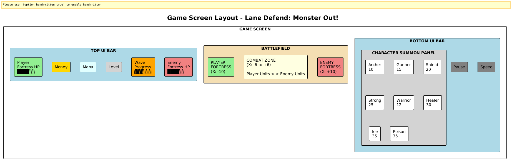 | Bố cục tổng quan màn hình game |
| 02 | 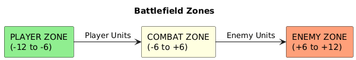 | Các vùng trên chiến trường |
| 03 |  | Layout theo độ khó level |
| 04 | 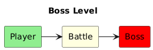 | Layout màn Boss |

---

### 2. Sơ đồ công nghệ - Technology Diagram (4 files)

| # | File | Mô tả |
|---|------|-------|
| 05 | 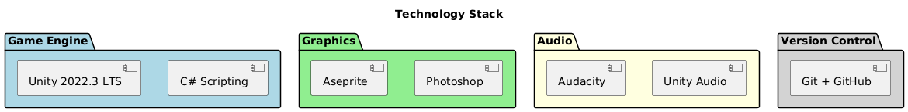 | Kiến trúc công nghệ tổng quan |
| 06 | 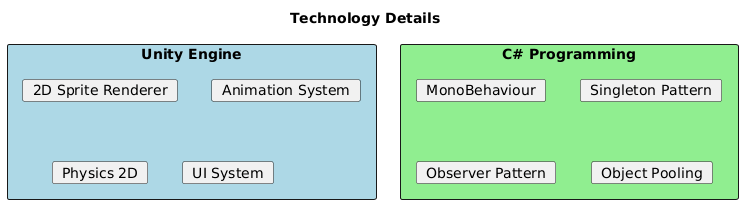 | Chi tiết công nghệ sử dụng |
| 07 | 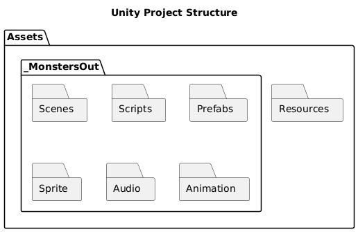 | Cấu trúc dự án Unity |
| 08 | 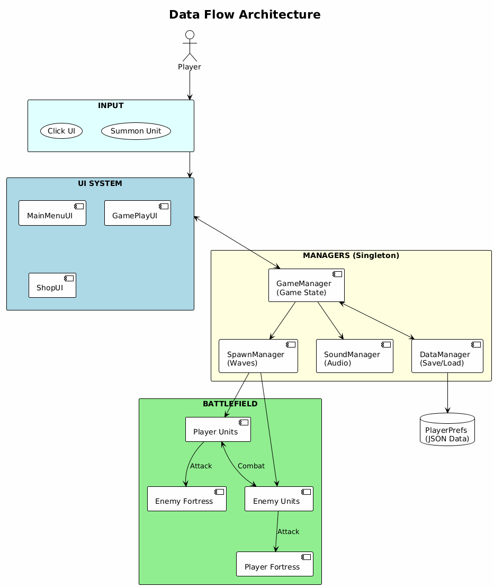 | Luồng dữ liệu trong game |

---

### 3. Sơ đồ nhóm thiết kế - Design Team Diagram (3 files)

| # | File | Mô tả |
|---|------|-------|
| 09 |  | Cấu trúc nhóm phát triển |
| 10 | 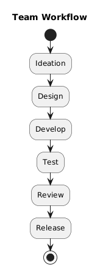 | Quy trình làm việc của team |
| 11 | 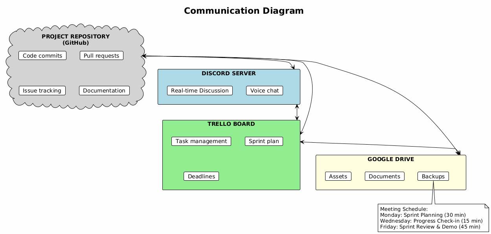 | Kênh giao tiếp trong team |

---

### 4. Sơ đồ triển khai - Implementation Diagram (2 files)

| # | File | Mô tả |
|---|------|-------|
| 12 | 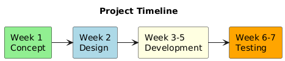 | Timeline dự án 7 tuần |
| 13 | 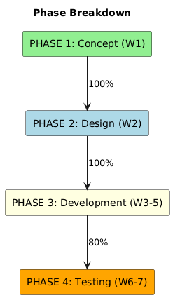 | Chi tiết các giai đoạn phát triển |

---

### 5. Sơ đồ kịch bản trò chơi - Gameplay Diagram (8 files)

| # | File | Mô tả |
|---|------|-------|
| 14 |  | Luồng game chính |
| 15 | 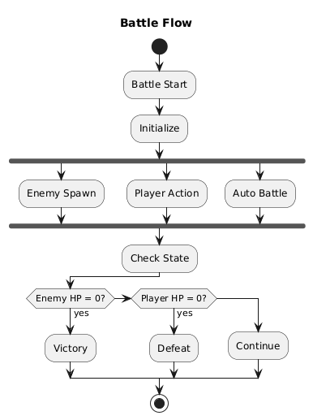 | Luồng trận đánh |
| 16 | 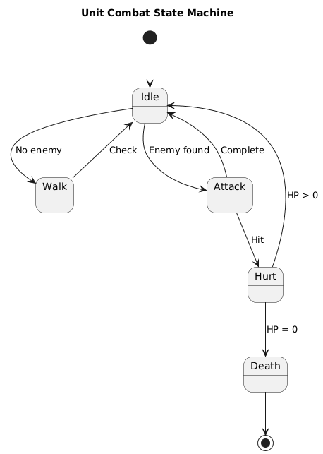 | State machine của unit |
| 17 |  | Tiến trình người chơi |
| 18 | 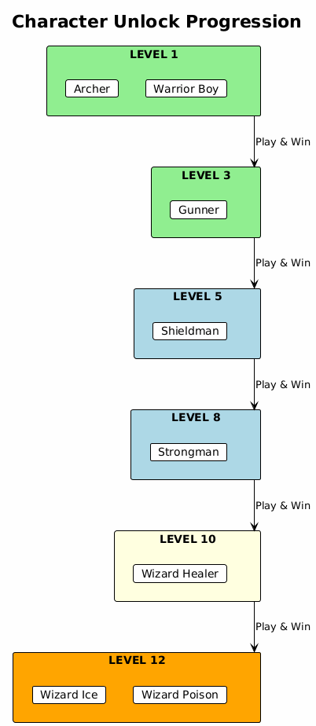 | Mở khóa nhân vật |
| 19 | 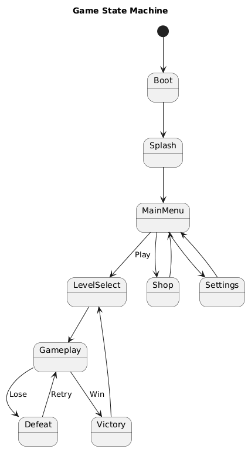 | State machine toàn game |
| 20 | 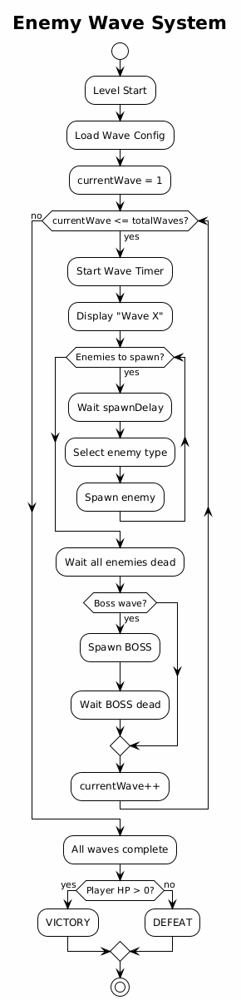 | Hệ thống wave enemy |
| 21 | 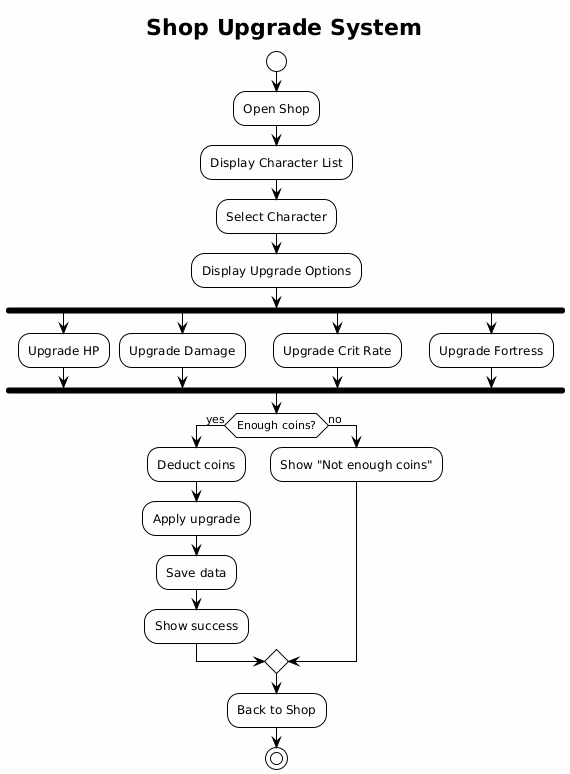 | Hệ thống shop & upgrade |

---

### 6. Sơ đồ Class (Bonus) (2 files)

| # | File | Mô tả |
|---|------|-------|
| 22 | 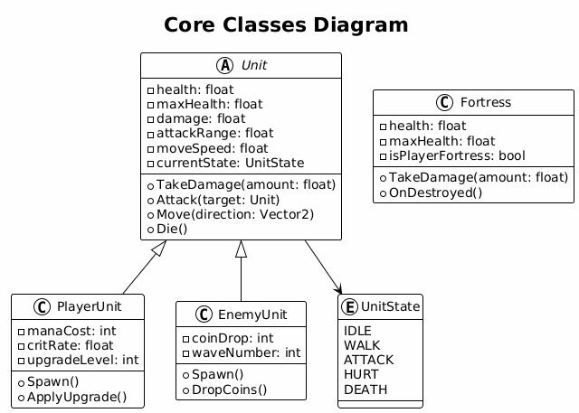 | Các class core (Unit, Fortress) |
| 23 | 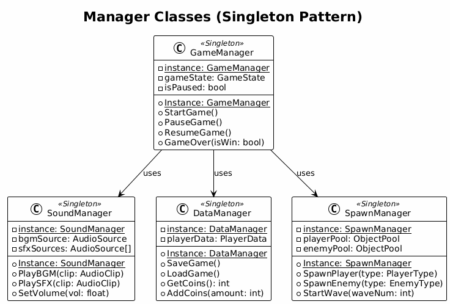 | Các Manager class (Singleton) |

---

## Tổng kết

| Loại sơ đồ | Số lượng |
|------------|----------|
| Layout Diagram | 4 |
| Technology Diagram | 4 |
| Design Team Diagram | 3 |
| Implementation Diagram | 2 |
| Gameplay Diagram | 8 |
| Class Diagram | 2 |
| **Tổng cộng** | **23** |

---

## Hình ảnh chi tiết

### 01. Game Screen Layout

### 02. Battlefield Zones

### 03. Level Layouts

### 04. Boss Level Layout

### 05. Technology Stack

### 06. Technology Details

### 07. Unity Project Structure

### 08. Data Flow Architecture

### 09. Team Structure

### 10. Team Workflow

### 11. Communication Diagram

### 12. Project Timeline

### 13. Phase Breakdown

### 14. Main Game Flow

### 15. Battle Flow

### 16. Unit Combat Flow

### 17. Player Progression Flow

### 18. Character Unlock

### 19. Game State Machine

### 20. Enemy Wave System

### 21. Shop Upgrade System

### 22. Core Classes

### 23. Manager Classes

---

**Game:** Lane Defend: Monster Out!
**Version:** 1.0
